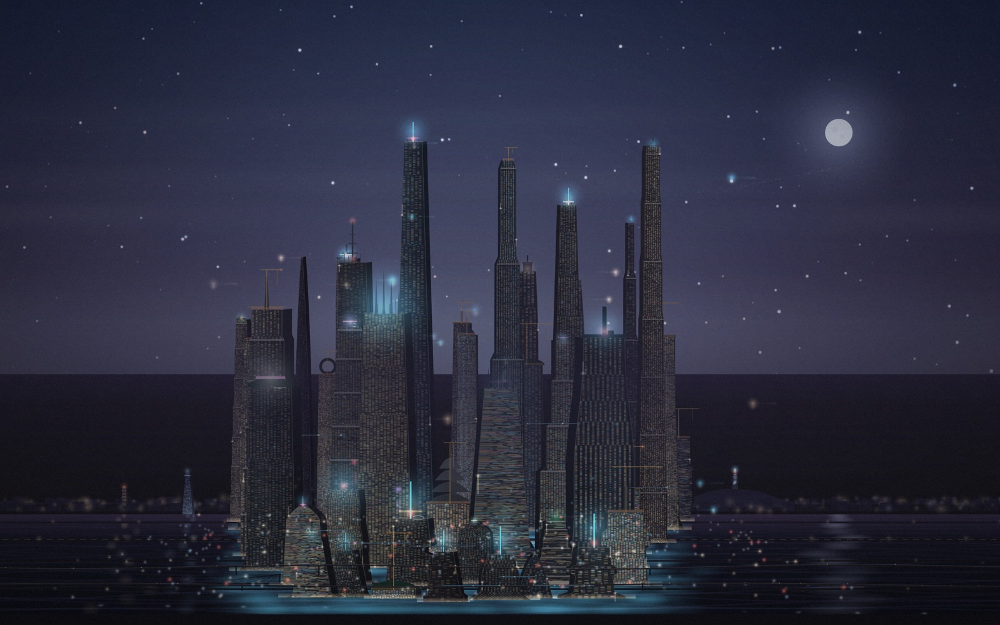
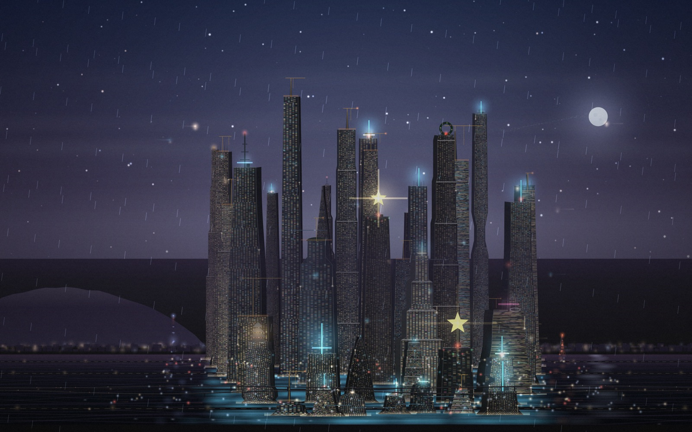
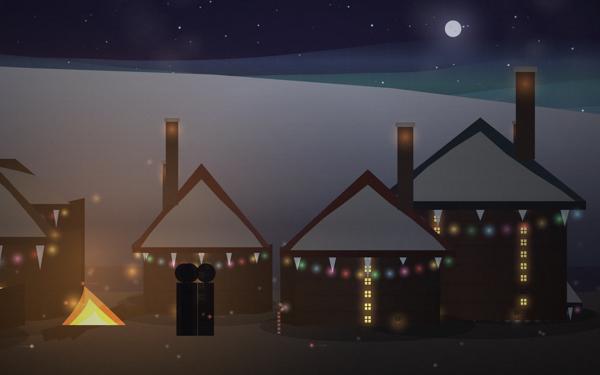
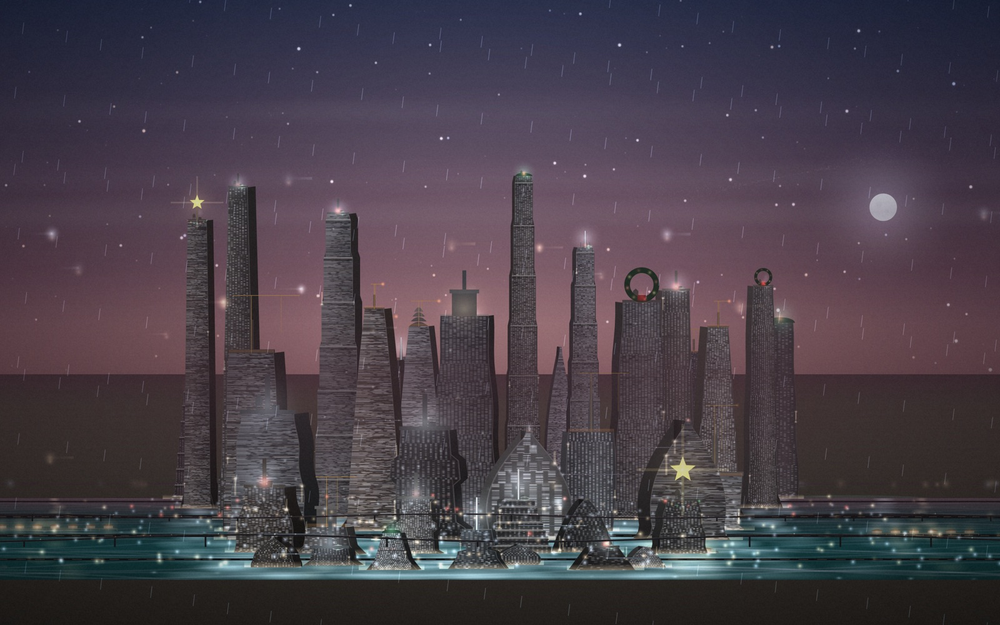
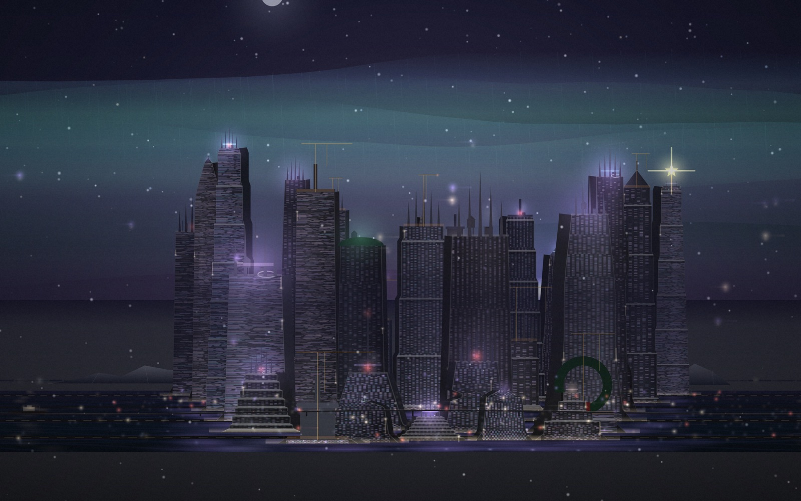
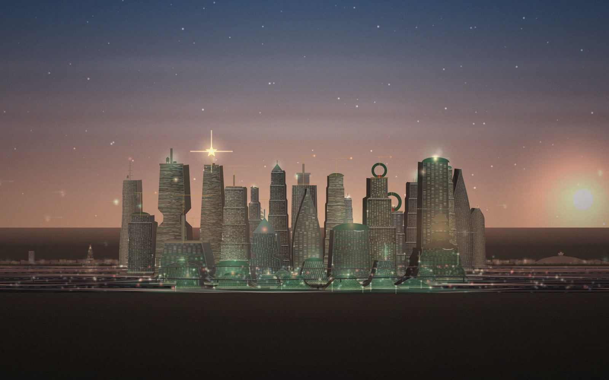
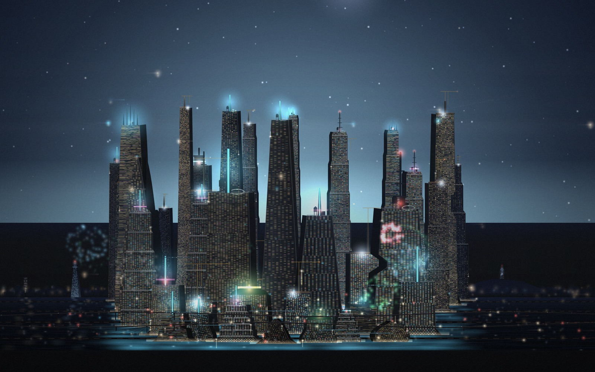
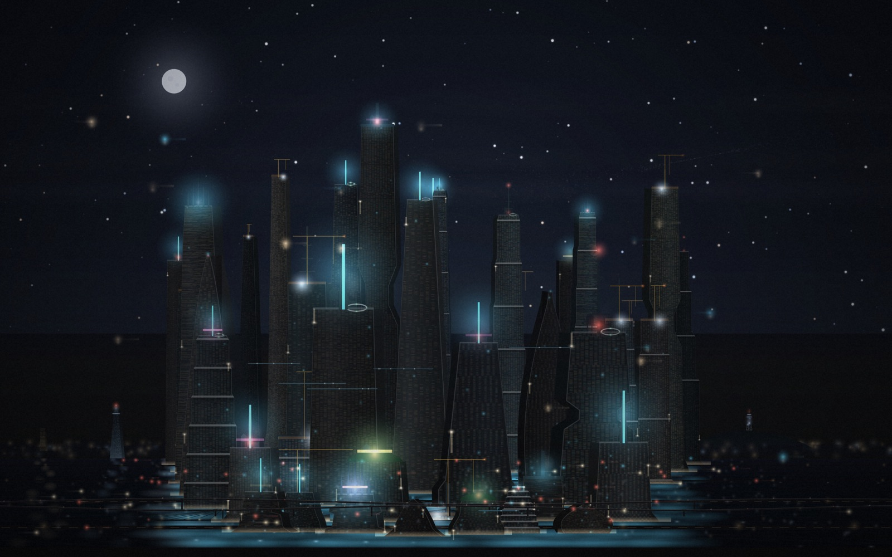
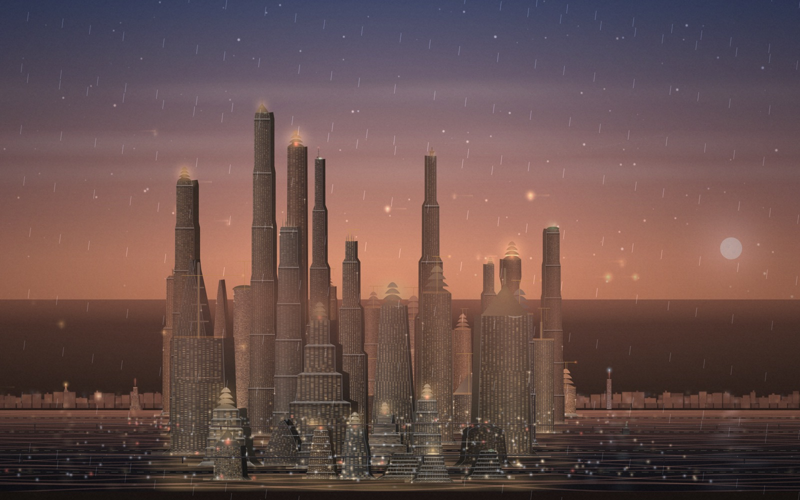

# 싱귤래리티 시티 · SINGULARITY CITY

> **특이점은 위로 자란다.**
> AGI가 밤새 스스로 층을 올리는 초고층 수직도시 시뮬레이터.
> 당신이 하는 일은 도시에 이름을 붙이고, 불을 끄고, 바라보는 것뿐입니다.

**▶ 바로 플레이하기: https://leaf-kit.github.io/game-singularity-city/**



빌드 도구도, 프레임워크도, CDN도 쓰지 않습니다. `index.html` 과 `maps.js` 두 개를
브라우저로 열면 그게 전부입니다.

---

## 목차

- [무엇을 하는 게임인가](#무엇을-하는-게임인가)
- [바로 실행하기](#바로-실행하기)
- [게임의 규칙](#게임의-규칙)
- [부지 — 11개의 무대](#부지--11개의-무대)
- [도시 무드](#도시-무드)
- [시간대 고정](#시간대-고정)
- [도시는 낡고, 다시 지어진다](#도시는-낡고-다시-지어진다)
- [스크린샷 저장과 X 공유](#스크린샷-저장과-x-공유)
- [조작](#조작)
- [URL 파라미터](#url-파라미터)
- [맵 추가하기](#맵-추가하기)
- [설계 메모](#설계-메모)
- [파일 구성](#파일-구성)
- [라이선스](#라이선스)

---

## 무엇을 하는 게임인가

심시티에서 가장 오래 기억에 남는 순간은 도로를 긋는 순간이 아니라,
**어느 날 문득 고개를 들었더니 마천루가 서 있던 순간**이었습니다.
이 게임은 그 순간만 남기고 나머지를 전부 덜어냈습니다.

- 부지와 도시 이름, 시장 이름을 정하고 **기공식** 버튼을 누릅니다.
- 그 다음부터는 **AGI가 알아서** 짓습니다. 착공하고, 크레인을 돌리고,
  층을 쌓고, 완공하면 옥상 조명을 켜고, 사람을 들입니다.
- 인구가 늘면 전력이 모자라고, 전력이 모자라면 공사가 느려지고,
  그러면 AGI가 발전망을 증설합니다. 그 되먹임이 도시의 리듬을 만듭니다.
- 목표는 하나. **인구 1억 명 — 특이점 돌파.** 그리고 그 뒤로도 **100억까지** 갑니다.
- 도시는 완성되고 끝나지 않습니다. 건물은 **낡고, 헐리고, 더 높은 것이 들어섭니다.**

해가 뜨고 집니다. 밤이 되면 창문에 불이 들어오고, 에어택시가 항로를 따라 흐르고,
지상에는 헤드라이트가 지나갑니다. 6초간 손을 대지 않으면 UI가 전부 사라지고
**관망 모드**로 넘어갑니다 — 그대로 스크린세이버로 틀어두라고 만든 화면입니다.



---

## 바로 실행하기

### 1. 그냥 열기

```
index.html 을 더블클릭
```

정적 페이지라 이것만으로 동작합니다. 일부 브라우저가 `file://` 에서
하위 스크립트(`maps.js`) 로드를 막는 경우에만 아래 방법을 쓰세요.

### 2. 로컬 서버로 열기

```bash
python3 serve.py            # http://localhost:8004
python3 serve.py 8080       # 포트 지정

./start_server.sh           # 같은 것, 셸 스크립트 버전
```

서버를 띄우면 같은 와이파이의 휴대폰에서 접속할 주소도 함께 찍어줍니다.
전체화면·클립보드 복사·기기 공유처럼 보안 컨텍스트를 타는 기능도 이쪽에서 온전히 동작합니다.

### 3. 정적 호스팅에 올리기

저장소를 그대로 GitHub Pages / Netlify / S3 에 올리면 끝입니다.
빌드 단계가 없습니다. (`.nojekyll` 이 이미 들어 있습니다.)

---

## 게임의 규칙

### 인구 — 1억이 분기점, 100억이 끝

각 타워는 층마다 사람을 받습니다. 층당 수용 인원은 바닥 면적에 비례하고,
**도시 전체의 잠재 수용 인원이 목표치를 살짝 넘도록 자동 보정**됩니다.
그래서 어느 부지를 고르든 결승선의 위치가 같습니다 — 가는 길만 다릅니다.
(마을 부지만 예외입니다 — 크리스마스 마을 9,500명, 숲 공원 13,000명. 마을이니까요.)

| 지표 | 의미 |
|---|---|
| **인구** | 입주 완료 인원. 1억이 특이점 돌파선입니다. |
| **최고 높이** | 도시에서 가장 높은 타워. 500m마다 기록이 남습니다. |
| **완공 / 건설중** | 다 지은 타워 수 / 지금 크레인이 올라가 있는 타워 수. |
| **연산량** | 도시가 굴리는 총 연산. PF → EF → ZF 로 자릿수가 올라갑니다. |
| **전력 여유** | 공급 대비 여유분. 12% 아래로 떨어지면 막대가 붉어지고 공사가 느려집니다. |
| **시민 만족도** | 전력 여유·완공률·녹지·과밀도가 함께 결정합니다. |

### 되먹임 고리

```
층이 오른다 → 인구가 는다 → 전력 수요가 는다 → 여유가 줄면 공사가 느려진다
     ↑                                                        ↓
     └──────────────── AGI가 발전망을 증설한다 ←───────────────┘
```

전력 여유가 넉넉하면 동시 착공 슬롯이 최대 6개까지 열리고,
빠듯하면 2개로 줄어듭니다. 그래서 도시는 일정하게 자라지 않고 계단처럼 자랍니다.

### 성장 속도

| 프리셋 | 1억까지 | 쓰임 |
|---|---:|---|
| 느긋하게 | 약 50분 | 밤새 틀어두는 스크린세이버 |
| 보통 | 약 19분 | 커피 한 잔이면 도시 하나 |
| 빠르게 | 약 7분 | 눈에 보이게 층이 쌓임 |
| 폭주 | 약 2분 | AGI가 브레이크를 놓았을 때 |

1억은 결승선이 아니라 **분기점**입니다. 그 뒤로는 재개발이 돌기 시작하고,
세대가 바뀔 때마다 같은 자리가 더 높고 더 촘촘해집니다 — 끝은 **인구 100억**입니다.

실행 중에도 하단 `»` 버튼이나 <kbd>1</kbd><kbd>2</kbd><kbd>3</kbd> 키로 ×1 / ×3 / ×8 배속을 걸 수 있습니다.

---

## 부지 — 11개의 무대

각 부지는 지형·기후·하늘색·랜드마크가 전부 다릅니다.
랜드마크는 실제 축척으로 서 있어서, 555m 롯데월드타워가 3,000m 마천루의
발목에 닿는 광경을 보게 됩니다.

**그리고 모든 부지가 초고층인 것은 아닙니다.**
파리는 1,400m에서 멈추고, 몰디브는 리조트 스케일이며,
크리스마스 마을과 숲 공원은 아예 마천루가 없는 **마을**입니다.

| 부지 | 최고 높이 | 랜드마크 | 특징 |
|---|---:|---|---|
| 🇰🇷 **잠실** | 3,300m | 롯데월드타워 · N서울타워(남산 위) · 63빌딩 · 잠실 주경기장 · 올림픽대교 | 밤마다 **서울세계불꽃축제** |
| 🗽 **뉴욕** | 3,600m | 엠파이어 스테이트 · 크라이슬러 · 원 WTC · 자유의 여신상 · 브루클린 브리지 | 아르데코 셋백과 석조 파사드 |
| 🗼 **파리** | 1,400m | 에펠탑 · 개선문 · 사크레쾨르 · 몽파르나스 타워 | 높이를 자제하는 도시 |
| 🎡 **런던** | 2,600m | 빅벤 · 웨스트민스터 궁 · 런던아이 · 더 샤드 · 거킨 · 세인트폴 · 타워브리지 | 안개가 가장 짙은 부지 |
| 🗾 **도쿄** | 3,500m | 도쿄타워 · 스카이트리 · 후지산 · 레인보우 브리지 | 곧은 슬래브와 안테나 숲 |
| 🏜️ **네옴** | 4,400m | 더 라인(거울 장벽) · 트로제나 링 · 샤르카 능선 | 가장 높이 자라는 부지 |
| 🏝️ **몰디브** | 1,800m | 수상 빌라 · 야자 모래섬 · 수상 비행장 · 환초 | 물이 가장 맑아 도시가 두 번 보임 |
| 🎄 **크리스마스 마을** | 24m | 광장의 트리 · 산타의 공방 · 눈의 예배당 · 전나무 숲 | 마천루가 없는 **마을 부지** |
| 🌳 **숲 공원** | 28m | 삼백 년 참나무 · 호수 산장 · 보트 창고 · 전나무 숲 · 등불 산책길 | 마을 부지 · 밤이면 **반딧불** |
| 🐧 **남극** | 2,400m | 빙산 A-76 · 보스토크 기지 · 횡단산맥 · 오로라 | 외기 −60℃, 냉각 비용 0 |
| ❄️ **북극** | 2,100m | 부빙 단애 · 쇄빙선 아르크티카 · 표류 등대 · 오로라 | 오로라가 가장 강한 부지 |

극지 세 부지는 **위도에 따라 백야와 극야가 계산**됩니다. 겨울에는 해가 뜨지 않고,
오로라가 유일한 조명이 됩니다.

### 🎄 크리스마스 마을 · 🌳 숲 공원

**마천루가 서지 않는 두 부지**입니다. 대신 통나무집이 골목을 이루며 퍼집니다.

두 부지가 공유하는 것:

- 창마다 화목 난로의 주황빛이 새고, **굴뚝에서 연기가 오릅니다**
- 집집마다 **모닥불**이 있고, 그 앞에 사람들이 서 있습니다
- 목표 인구가 1억이 아니라 마을 규모입니다 — 9,500명 / 13,000명

**크리스마스 마을**은 눈에 파묻힙니다. 처마마다 색전구가 걸리고,
지붕에 눈이 쌓이고 고드름이 달리고, 문에는 리스가 걸립니다.
오로라가 하늘을 덮고, **밤마다 루돌프 여덟 마리가 끄는 썰매가 지나갑니다.**
맨 앞 한 마리만 코가 빨갛습니다. 방울 소리도 납니다.

**숲 공원**은 반대쪽입니다. 눈도 색전구도 없습니다.
지붕에는 눈 대신 **이끼**가 앉고, 처마에는 등불 두세 개만 걸립니다.

- 나무를 **다른 부지의 다섯 배 밀도로** 심습니다 — 침엽수와 참나무가 산장을 덮습니다
- 삼백 년 참나무, 호수 산장, 보트 창고, 나무 다리, 그리고 **등불 산책길**
- 밤이면 지면에 **반딧불**이 떠오릅니다. 깜빡이는 시간이 꺼져 있는 시간보다 짧습니다
- 교통량을 눌러 두었습니다 — 차도 비행체도 거의 지나가지 않습니다



### 🎆 서울세계불꽃축제

잠실 부지에서는 **해가 지면 한강 위로 셸이 올라갑니다.**
모란·수양·고리·야자·크래클 다섯 가지 형태가 섞이고, 가끔 **연발 피날레**가 터집니다.
터진 빛은 수면에도 그대로 흩어집니다.





---

## 도시 무드

무드는 부지와 독립입니다. 창문 색·옥상 마감·네온 세기·공기색이 바뀝니다.

| 무드 | 성격 |
|---|---|
| **네온 오버드라이브** | 시안과 마젠타. 옥상 사인이 흐릅니다. |
| **화이트 모놀리스** | 순백 콘크리트와 차가운 흰빛. 소음이 없는 도시. |
| **바이오 테라스** | 층마다 숲이 매달리고 옥상이 정원이 됩니다. |
| **골드 에이지** | 황금빛 아르데코 크라운. 따뜻하고 오래된 미래. |
| **퀀텀 바이올렛** | 연산 코어의 보라색 맥동이 외벽을 타고 오릅니다. |
| **크리스마스** | 창마다 빨강과 초록이 켜지고 옥상마다 별이 뜹니다. |

부지를 고르면 어울리는 무드가 자동으로 함께 잡힙니다(바꿀 수 있습니다).

### 건물은 어떻게 생겼나

심시티 2000의 마천루 어휘를 그대로 씁니다. 같은 건물이 두 번 서지 않습니다.

- **실루엣 31종** — 아르데코 셋백 · 지구라트 · 오벨리스크 · 슬래브 · 바늘 · 방추 ·
  나선 · 비틀림 · 잘록한 허리 · 기운 탑 · 십자 단면 · 파일런 · **번들 튜브** ·
  **모따기** · **부벽** · **돛** · **메사** · **드럼** · **계단식 테라스** · **샤드** ·
  **나비** · **젠가** · **파고다** · **지느러미** · **배럴** · **캔틸레버** ·
  **아콜로지** · **쌍둥이** · **모듈** …
- **파사드 17종** — 커튼월 / 격자 / 석조 / 수직리브 / 리본창 / 다이아그리드 /
  대형 패널 / 체커 / **루버** / **발코니** / **현창** / **모자이크** / **수직띠** /
  **돌출창** / **셰브론** / **콘크리트 격자** / **수직정원**.
  창 크기·간격·점등률·층간 스팬드럴·수직 멀리언이 전부 다릅니다.
- **외벽 트림 10종** — 모서리띠 / 가로밴드 / 상부 색분리 / 기단 색분리 / 수직 띠 /
  프레임 / 좌우 분할 / 덩어리 / 코어선. 건물마다 다른 옷을 입습니다.
- **옥상** — 물탱크, 냉각탑(배기 아지랑이까지), 헬리패드, 안테나 군집, 옥상 난간
- **크라운 10종** — 블레이드 / 스파이크 / 아르데코 / 피라미드 / 물탱크 / 안테나 /
  정원 / 평지붕 / **트리 별** / **리스**
- **저층 기단(포디움)** 과 **기계층**(창 없는 루버 띠)이 주기적으로 들어갑니다
- 밤에는 지상 로비가 환하고, 외벽 엘리베이터 캡슐이 오르내리고,
  완공된 타워 사이에 **스카이브릿지**가 걸립니다
- 지상에는 **도로**가 깔리고 그 위를 **고가도로**가 넘어갑니다

### 부지마다, 자리마다 다른 건물

건물의 생김새는 세 겹으로 결정됩니다.

```
도시의 건축 성향  ×  그 자리의 용도  ×  무드
 (뉴욕은 아르데코)    (코어는 업무동)     (네온은 시안)
```

부지 안의 각 자리에는 **용도**가 배정됩니다 —
업무 · 주거 · 공공 · 상업 · 산업 · **연산** · **수직농장** · **연구**.
용도마다 선호하는 실루엣과 파사드, 옥상 마감, 창문 색, 점등률, 녹화율이 다릅니다.
업무동은 늦게까지 차갑고 하얗게 켜져 있고, 주거동은 따뜻한 빛이 듬성듬성 남습니다.
연산동은 열이 새지 않도록 창을 거의 내지 않고, 수직농장은 외벽이 통째로 초록입니다.

외벽 색도 마찬가지입니다. 도시마다 **고유 팔레트**가 있고
(뉴욕은 석회암·벽돌·청동, 파리는 크림빛 석회암, 도쿄는 은회색),
거기에 용도가 색조를 틀고, 파사드 재질이 한 번 더 밉니다.

마지막으로 건물마다 **색상환을 ±10~22° 돌려** 개성을 주고,
그 다음 **도시의 살색으로 다시 당겨옵니다**(`hueVar` × `cohere`).
이 두 단계가 "예순 채가 다 다르게 생겼는데 한 도시로 보인다"를 만듭니다.
색을 돌리기만 하면 도시가 무지개가 되고, 당기기만 하면 아파트 단지가 됩니다.

### 도시는 초록을 입는다

식물은 바이오 무드의 장식이 아니라 모든 도시의 기본값입니다.

- **수직 녹화** — 몇 층마다 화단이 걸리고 거기서 덩굴이 흘러내립니다.
  밤에는 화단 조명이 은근히 켜집니다.
- **옥상 정원 · 태양광** — 옥상마다 화단 한 줄과 나무 몇 그루, 기운 태양광 패널.
- **가로수** — 지면에 활엽수 · 침엽수 · 야자 · 관목 · 화단이 줄지어 심깁니다.
  타워와 같은 깊이 리스트에 들어가므로 앞줄 나무가 뒤의 마천루를 가립니다.
- **기후가 종을 정합니다** — 몰디브는 야자, 파리는 마로니에, 도쿄는 은행나무,
  크리스마스 마을은 전나무. 그리고 극지에는 나무를 심지 않습니다 —
  대신 **유리 온실 돔**이 저층에 붙고, 밤이면 성장등의 초록빛이 새어 나옵니다.



---

## 시간대 고정

기본은 **자동 순환** — 하루가 2분 48초로 흐릅니다.
하지만 "지금 이 하늘"이 마음에 들면 그대로 묶어둘 수 있습니다.
시작 화면에서 고르거나, 실행 중 <kbd>T</kbd> 키 / 하단 **◔** 버튼으로 돌립니다.

| 시간대 | 시각 | 성격 |
|---|---:|---|
| **자동 순환** | — | 해가 뜨고 집니다 |
| **아침** | 06:24 | 창문의 불이 하나씩 꺼집니다 |
| **점심** | 12:42 | 유리에 하늘이 통째로 비칩니다 |
| **저녁** | 18:24 | 하늘이 타고 도시에 불이 들어옵니다 |
| **깜깜한 밤** | 21:36 | 표준 야경. 창문이 가장 많이 켜진 시각 |
| **분위기 있는 밤** | 23:12 | 도시광이 하늘로 번지고 네온이 안개에 녹습니다 |
| **칠흑같은 밤** | 03:06 | 대부분의 불이 꺼지고 별과 달만 남습니다 |

세 가지 밤은 시각만 다른 게 아닙니다. 하늘 밝기, 도시광 세기, 창문 점등률,
별의 밝기, 안개 농도, 비네트가 각각 다른 값으로 함께 움직입니다.

| 분위기 있는 밤 | 칠흑같은 밤 |
|---|---|
|  |  |

---

## 도시는 낡고, 다시 지어진다

도시는 완성되면 끝나는 것이 아닙니다.

1. 완공된 건물은 그 순간부터 **낡기 시작합니다.** 색이 빠지고, 빈집이 늘어
   불 켜진 창이 줄어듭니다.
2. 도시의 3분의 2가 자리를 잡은 뒤, 가장 낡은 건물부터 **해체**됩니다.
   위에서부터 층이 잘려 나가고 먼지가 피어오릅니다.
3. 같은 자리에 **다음 세대**가 올라옵니다. 더 높고, 실루엣도 파사드도 크라운도
   전부 새로 뽑힙니다. 그리고 층 구성이 한 단계 더 촘촘해집니다.

그래서 인구는 1억에서 멈추지 않고 100억까지 밀려 올라가고,
스카이라인은 몇 번이고 바뀝니다. 타워를 클릭하면 **몇 세대째인지, 몇 퍼센트 낡았는지**
볼 수 있습니다.

좌측 하단 **스토리라인**에 이 모든 사건이 한 줄씩 남습니다 —
착공, 완공, 전력망 증설, 인구 돌파, 해체, 재개발, 축제 개막.
조용해지면 **5초 뒤 알아서 사라집니다.**

---

## 스크린샷 저장과 X 공유

하단의 **◍ 저장 · 공유** 버튼 또는 <kbd>S</kbd> 키를 누르면
지금 화면에 도시 명패를 합성한 이미지를 만들어 보여줍니다.

명패에는 도시 이름, 시장 이름, 인구, 최고 높이, 완공 타워 수, 연산량, 경과 일수가
새겨집니다. 특이점을 돌파한 뒤라면 우측 상단에 **◆ 특이점 돌파 · 인구 1억** 배지가 붙습니다.

| 버튼 | 동작 |
|---|---|
| **⤓ PNG 저장** | `singularity-city_도시명_날짜.png` 로 내려받습니다 |
| **𝕏 X에 공유** | PNG를 먼저 저장한 뒤 X 글 작성창을 엽니다 |
| **⧉ 이미지 복사** | 클립보드로 복사합니다 (모바일에서는 **⇪ 기기 공유** 로 바뀝니다) |

> X는 외부 링크로 이미지를 자동 첨부하는 기능을 제공하지 않습니다.
> 그래서 이 게임은 **먼저 PNG를 저장해 두고** 작성창을 엽니다 —
> 저장된 파일을 작성창에 끌어다 놓으면 됩니다.
> 모바일이라면 **기기 공유** 버튼이 이미지와 문구를 한 번에 넘겨줍니다.

공유 문구는 이런 모양입니다.

```
「뉴 잠실」 — 시장 리프킷
인구 1.02억 · 최고 3,272m · 31개 타워 완공
특이점 돌파 ◆ 인구 1억 달성

#싱귤래리티시티 #SingularityCity
```

---

## 조작

| 입력 | 동작 |
|---|---|
| 드래그 | 화면 이동 (수동 카메라로 전환) |
| 휠 / 핀치 | 확대·축소 |
| 타워 클릭 | 층수·높이·거주 인구를 보고 그 타워로 카메라 이동 |
| <kbd>Esc</kbd> | 설정 화면으로 |
| <kbd>S</kbd> | 저장·공유 시트 |
| <kbd>C</kbd> | 다음 시점으로 전환 |
| <kbd>V</kbd> | 자동 / 수동 카메라 토글 |
| <kbd>Space</kbd> | 일시정지 |
| <kbd>1</kbd> <kbd>2</kbd> <kbd>3</kbd> | 배속 ×1 / ×3 / ×8 |
| <kbd>T</kbd> | 시간대 전환 (<kbd>Shift+T</kbd> 역순) |
| <kbd>M</kbd> | 사운드 |
| <kbd>F</kbd> | 전체화면 |

자동 카메라는 다섯 가지 시점을 번갈아 씁니다 —
**전경 · 수평 이동 · 건설 추적 · 첨탑 접사 · 지상 시점.**

---

## URL 파라미터

설정 화면을 건너뛰고 바로 시작할 수 있습니다. 스크린세이버나 공유 링크에 쓰세요.

```
index.html?auto=1&map=christmas&time=vibe&pace=slow&city=노엘&mayor=진욱
```

| 파라미터 | 값 |
|---|---|
| `auto` | `1` 이면 즉시 시작 |
| `map` | `jamsil` `newyork` `paris` `tokyo` `neom` `maldives` `christmas` `antarctica` `arctic` |
| `mood` | `neon` `mono` `bio` `gold` `xmas` `quantum` |
| `pace` | `slow` `normal` `fast` `surge` |
| `time` | `auto` `dawn` `noon` `dusk` `night` `vibe` `pitch` |
| `city` | 도시 이름 (한글 가능) |
| `mayor` | 시장 이름 |

---

## 맵 추가하기

맵은 `maps.js` 한 파일에 모여 있습니다. 엔진(`index.html`)은 손대지 않아도 됩니다.

```js
myCity: {
  name: '부산', en: 'BUSAN · HAEUNDAE', emoji: '🌊',
  tagline: '바다 위로 솟은 수직도시.',
  hint: '광안대교가 발치에 남습니다.',
  cityDefault: '뉴 해운대',
  lat: 35.1,
  climate: 'temperate',
  ground: { type: 'bay', color: [24, 28, 38],
            water: { d0: 0, d1: .28, color: [10, 20, 34], reflect: .6 } },
  sky: { hazeK: 1.0, tintDay: [190, 208, 226], tintNight: [22, 30, 50] },
  aurora: 0, snow: 0, rainOdds: .2,
  districts: [{ d: .92, h: 80, density: .9, tint: [30, 38, 54] }],
  landmarks: [
    { id: 'gwangan', name: '광안대교', x: 2800, d: .2,
      parts: [{ k: 'bridge', y: 0, w: 2600, style: 'suspension' }] },
  ],
  lots: CORE(99, 3000),
  facts: ['해운대 앞바다가 도시의 냉각수입니다.'],
}
```

### 좌표계

- `x` 가로(미터), 도심 중심이 0
- `y` 세로(미터), 지면이 0이고 **위로 갈수록 음수**. 롯데월드타워 555m → `y: -555`
- `d` 깊이. `0` = 최전면, `1` = 지평선. 원근 축소·안개·시차에 함께 쓰입니다

### 랜드마크 프리미티브

`parts` 배열에 도형 조각을 쌓아 실루엣을 만듭니다. 엔진이 해석하는 종류는 33가지입니다.

| | | |
|---|---|---|
| `taper` 사다리꼴 몸통 | `box` 직육면체 | `spire` 첨탑 |
| `mast` 안테나 기둥 | `deck` 전망대 슬래브 | `lattice` 철골 격자탑 |
| `arch` 아치문 | `dome` 돔 | `sphere` 구체 |
| `ring` 기울어진 고리 | `statue` 입상 | `wall` 거울 장벽 |
| `mount` 산 능선 | `berg` 빙산 | `dish` 파라볼라 |
| `hut` 기지 막사 | `ship` 쇄빙선 | `bridge` 교량 |
| `stadium` 경기장 | `crown` 방사형 왕관 | `beacon` 점멸등 |
| `lightrow` 조명 띠 | `tree` 크리스마스 트리 | `snowman` 눈사람 |
| `candycane` 캔디케인 | `gift` 선물 더미 | `palm` 야자수 |
| `overwater` 수상 빌라 | `clock` 시계 문자판 | `wheel` 관람차 |
| `bulb` 총알형 몸통 | `broad` 활엽수 거목 | `lamp` 공원 등불 |

모든 파츠는 `tint`(기본색), `win`(`grid`/`band`/`sparse`), `off`(가로 오프셋)를 받습니다.
랜드마크 단위로 `glow`(야간 조명색)와 `scale`을 줄 수 있습니다.

`clock` 의 바늘은 도시 시계와 같은 시각을 가리키고, `tree` 는 `lights: 0`·`snow: 0`
을 주면 크리스마스 트리가 아니라 그냥 전나무가 됩니다.

부지(`lots`)는 `CORE(seed, 최고높이)` 헬퍼로 한 줄에 만들거나,
`row({d, n, x0, x1, w, max, seed, zone, hVar})` · `cluster({d, n, xc, span, ...})` 를
직접 조합해 배치를 정합니다. `CORE` 는 부지 개수를 시드로 매번 다르게 뽑고,
주변보다 머리 하나가 더 솟는 **초고층 1~3채**를 섞습니다.
`CORE` 는 초고층 코어부터 저층 켜까지 7줄을 한 번에 깔아 줍니다.

### 맵에 성격 주기

```js
style: {
  shapes:  { deco: 3.2, ziggurat: 2.6, twist: .4 },   // 실루엣 선호 가중치
  facades: { masonry: 2.6, curtain: .7 },             // 파사드 선호 가중치
  crowns:  ['deco', 'pyramid', 'spike'],              // 옥상 마감 후보
  palette: ['#4a4338', '#5a4a3c', '#3d3a34'],         // 외벽 색 후보
  body: '#3a3630', podium: .85, glassK: .7,
},
village: 1,           // 마천루 대신 오두막이 선다
popGoal: 9500,        // 목표 인구 (생략하면 1억)
xmas: 1,              // 밤마다 산타 썰매가 지나간다
festival: {           // 밤마다 불꽃이 오른다
  name: '서울세계불꽃축제', x0: -2400, x1: 2400, d: .24,
},
suggestMood: 'xmas',  // 이 부지를 고르면 함께 잡히는 무드
```

---

## 설계 메모

### 넓게가 아니라 높게

심시티의 전통적인 확장 방향은 가로입니다. 하지만 브라우저 Canvas 2D에서
가로 확장은 곧 **그려야 할 픽셀 수의 선형 증가**입니다.

그래서 이 게임은 부지를 **20~31개로 고정**하고 높이만 4,400m까지 올립니다.
화면에 들어오는 오브젝트 수가 처음부터 끝까지 거의 같아서,
인구 100명일 때와 1억 명일 때의 프레임 비용이 비슷합니다.

### 창문을 매 프레임 그리지 않는 법

4,400m 타워는 1,000층이 넘고, 층마다 창문이 20개씩이면 타워 하나에 2만 개입니다.
31개 타워면 60만 개 — 매 프레임 그릴 수 있는 수가 아닙니다.

대신 타워마다 오프스크린 캔버스를 한 장 잡아두고,
**층이 늘어난 순간에만 그 층 띠를 덧그립니다**(`winDrawn` 커서).
창문 + 층간 스팬드럴 + 수직 멀리언이 전부 이 한 장에 함께 구워집니다.
매 프레임 하는 일은 실루엣으로 클립하고 캔버스를 **한 번 blit** 하는 것뿐입니다.

층이 늘어나는 사건은 초당 몇 번뿐이므로, 사실상 공짜입니다.

### 하루는 끊기지 않는다

하늘·주변광·창문 점등률·인파 밀도·안개 농도가 전부 `hour`의 연속 함수입니다.
컷 전환이 한 군데도 없습니다 — 스크린세이버로 틀어둘 화면이라면
어느 순간에 봐도 어색한 경계가 없어야 하니까요.

야간 연출의 핵심은 두 가지입니다.

1. **전역 감광** — 밤에는 모든 구조물이 실루엣으로 가라앉습니다. 그래야 창문과 네온만 살아납니다.
2. **스카이글로우** — 도시가 뿜는 빛이 지평선 위로 번집니다. 이게 없으면
   랜드마크가 검은 덩어리가 되어 배경에 묻힙니다.

### 성능은 스스로 내려간다

`PERF` 가 48프레임마다 실제 프레임 시간을 재고 3단계 티어를 오르내립니다.
버리는 순서는 **해상도 배율 → 파티클 → 수면 반사 → 창문 깜빡임**.
실루엣과 조명은 최저 티어에서도 끝까지 지킵니다.

### 반사는 실루엣을 뒤집지 않는다

수면 반사에서 건물을 통째로 상하 반전해 다시 그리면 비용이 두 배입니다.
대신 **빛을 물결 조각으로 흩뿌립니다.** 물결의 성질 세 가지만 지키면 됩니다 —
멀수록 파장이 짧아 보이고, 반사는 수직으로 서지 않고 좌우로 흩어지며,
그 폭은 가까울수록 커집니다. 비용은 1/20인데 야경에서는 오히려 더 그럴듯합니다.

### 도시를 영원히 돌리는 법

건물이 완공되고 끝나면, 20분 뒤 화면은 정지 화면이 됩니다.
그래서 **노후 → 해체 → 재건축** 고리를 넣었습니다.
세대가 바뀔 때마다 높이와 밀도가 함께 올라가지만 둘 다 상한이 있어서,
인구는 100억 근처에서 수렴합니다. 그 뒤로는 스카이라인만 계속 바뀝니다 —
끝나지 않지만 폭주하지도 않는 상태입니다.



---

## 파일 구성

```
singularity-city/
├── index.html        게임 본체 — CSS·엔진·UI가 전부 들어 있습니다 (외부 의존 없음)
├── maps.js           맵 데이터 — 부지·랜드마크·무드·속도 프리셋 (여기만 고치면 맵이 늘어납니다)
├── serve.py          로컬 정적 서버 (선택)
├── start_server.sh   위 스크립트의 셸 래퍼
├── assets/           README용 스크린샷
├── .nojekyll         GitHub Pages 용
└── LICENSE           MIT
```

`index.html` 의 스크립트는 다음 순서로 읽으면 자연스럽습니다.

1. 유틸·상수·하늘 모델·스프라이트 베이크
2. `PRIM` — 랜드마크 프리미티브 렌더러 (33종)
3. `Tower` — 성장·노후·해체·재건축, 파사드·크라운·옥상, 그리고 마을 오두막
4. `Fireworks` — 축제용 셸과 파편
5. `City` — 인구·전력·연산·만족도·에이전트·날씨·도로·산타
6. `R` — 렌더 패스 (하늘 → 지면 → 도로 → 깊이 정렬된 오브젝트 → 대기 → 포스트)
7. `Cam` / `Sound` — 자동 카메라와 절차적 앰비언스
8. `UI` — HUD·스토리라인·스크린샷 합성·공유·입력·메인 루프

---

## 브라우저

Chrome · Safari · Firefox · Edge 최신 버전에서 동작합니다.
모바일에서도 돌아가며, 화면 폭이 좁으면 HUD가 자동으로 접힙니다.

사운드는 브라우저 정책상 **첫 클릭 이후**에만 켤 수 있습니다 (하단 ♪ 버튼).
음악 파일 없이 WebAudio로 저역 드론과 바람을 실시간 합성합니다.

---

## 라이선스

MIT — [LICENSE](LICENSE)

Leaf Meta · Coding Entertainment
